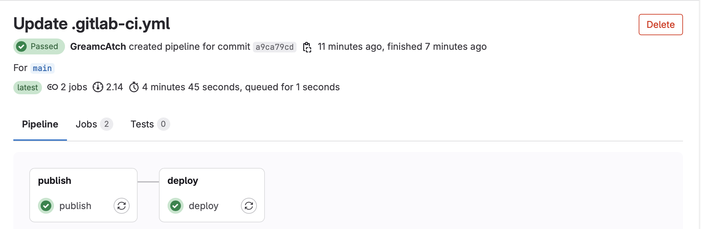

### Bank Service Application

Bank Service Application - simulating core banking operations through a microservices architecture.

Germany, 2023-2024.

##### System Architecture / Microservices Overview

- ##### Api-Gateway
    Entry point for all client requests

- ##### Auth-Service
    Handles authentication and authorization

- ##### Eureka-Server
    Service discovery and registration

- ##### Customer-Service
    Customer functions handled

- ##### Manager-Service
    Management functions handled

  | Category                | Core Components                                                          |
  |-------------------------|-------------------------------------------------------------------------|
  | **Backend Infrastructure** | Spring Boot 3.1.4  <br/>RESTful API  <br/>PostgreSQL  <br/>OAuth2     |
  | **DevOps & Deployment**  | Docker and Docker-Compose <br/> CI/CD <br/> Prometheus                                      |
  | **Testing Suite**        | JUnit 5 <br/> Spring Boot Test;<br/> MockMvc <br/>Mockito <br/> Testcontainers <br/> WireMock |
  | **Development Tools**    | Lombok <br/> MapStruct <br/> PostgreSQL                                                     |
  | **Security Features**    | Spring Security framework <br/> OAuth2 <br/> Role-based access control       |

  | Service          | Port |
  |------------------|------|
  | Api-Gateway      | 9000 |
  | Auth-Service     | 8084 |
  | Eureka-Server    | 8761 |
  | Customer-Service | 8082 |
  | Manager-Service  | 8081 |

##### CI/CD


#### Docker

##### Build all dockers


##### Docker all service


#### Testing

##### Auth-service test


##### Manager-service test


##### Customer-service test


#### Create Users

##### Admin create


##### Customer create


##### Manager create


##### Token


##### Setup and Installation

##### Prerequisites

- JDK 21
- Docker
- Docker Compose

##### Getting Started

1. **Clone the repository:**

   ```bash
   git clone https://github.com/YehorShyshkin/BankServiceProject.git
   cd BankServiceProject

2. **Build the project using Maven:**
   ```bash
   ./mvn clean install

3. **Run the application:**
    ```bash
   ./mvn spring-boot:run

4. **Run Docker Compose to start PostgreSQL and PgAdmin:**
    ```bash
    docker-compose up

Ensure that your docker-compose.yml file is correctly configured with the environment variables.

### Running Tests

To run the tests, use Maven:

    mvn test

### Configuration
Update the `.env` file with your PostgreSQL and PgAdmin credentials:

SPRING_DATASOURCE_USER=your_postgres_user  
SPRING_DATASOURCE_PASSWORD=your_postgres_password  
PGADMIN_DEFAULT_EMAIL=your_pgadmin_email  
PGADMIN_DEFAULT_PASSWORD=your_pgadmin_password